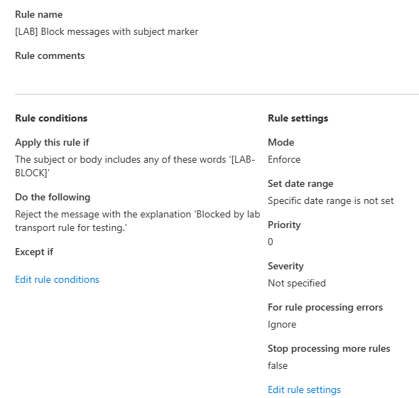
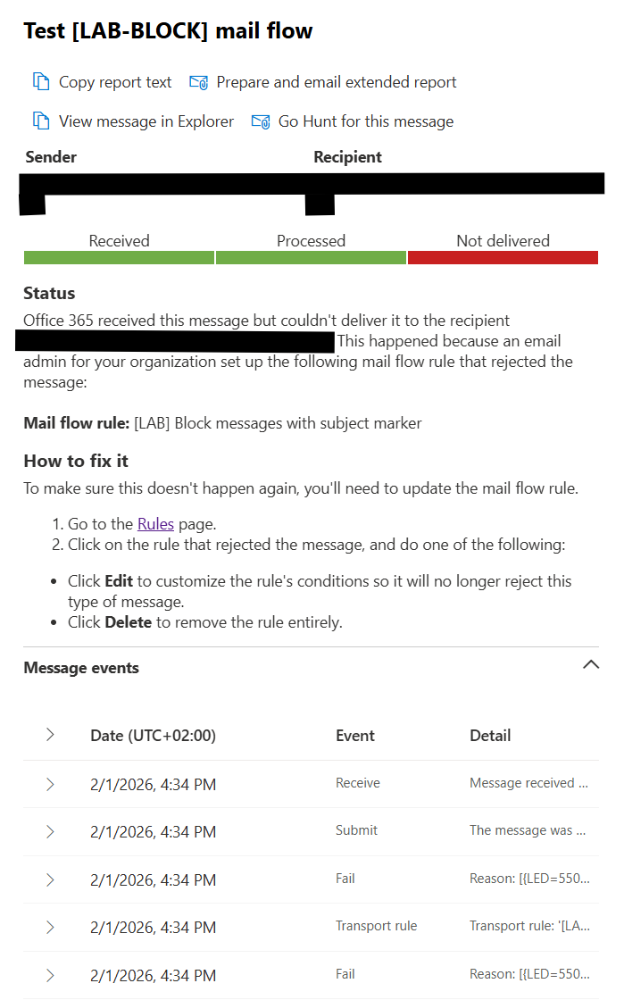
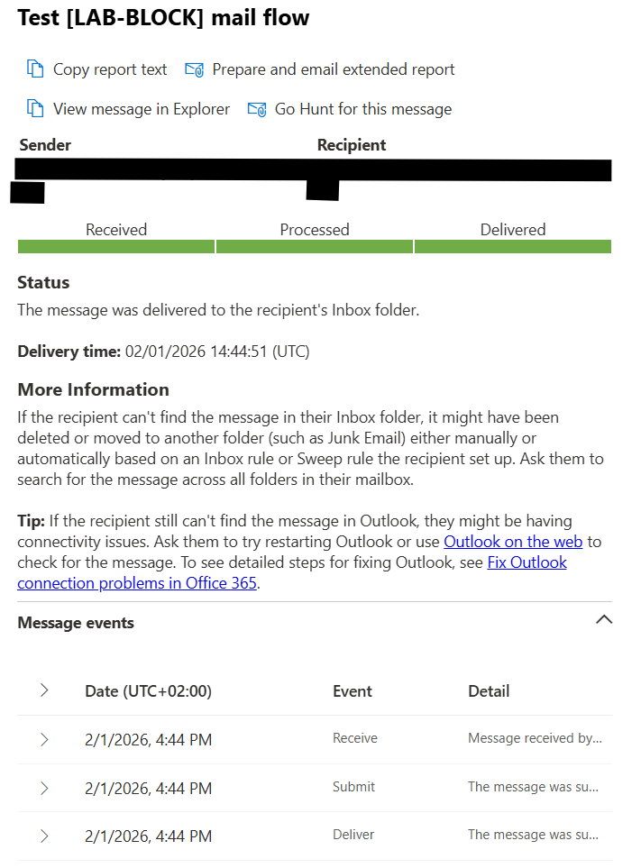

# EXO-TR-001 — Transport rule blocks messages with subject marker `[LAB-BLOCK]`

This case study demonstrates a safe, lab-only mail flow test with a clear root cause and a validated outcome:
**change -> validate (blocked) -> rollback -> validate (delivered)**.

## Scenario
A transport rule is created in **Exchange admin center** to reject messages that contain a subject/body marker `[LAB-BLOCK]`.
This is used to validate troubleshooting steps and evidence capture via **Message trace**.

## Change implemented (lab-only)
**Exchange admin center -> Mail flow -> Rules**
- Condition: subject or body includes `[LAB-BLOCK]`
- Action: Reject the message with explanation: `Blocked by lab transport rule for testing.`
- Mode: Enforce

## Validation
### 1) Negative test (expected block)
Send a test email with subject: `Test [LAB-BLOCK] mail flow`.

**Exchange admin center -> Mail flow -> Message trace**
- Result: **Not delivered**
- Details indicate the message was rejected by the transport rule.

### 2) Rollback
Disable (or delete) the lab rule after validation.

### 3) Positive test (delivery restored)
Send the same test again (without an active lab block rule).

**Exchange admin center -> Mail flow -> Message trace**
- Result: **Delivered**
- Delivered to recipient's Inbox folder

## Evidence (sanitized)
1) Transport rule overview:

2) Message trace (blocked):

3) Message trace (delivered after rollback):

## Notes
- Evidence is sanitized (no tenant domain/UPN/object IDs/message-id/IP/tenant name).
- This scenario is intentionally lab-scoped and should not be used as a production blocking pattern.
